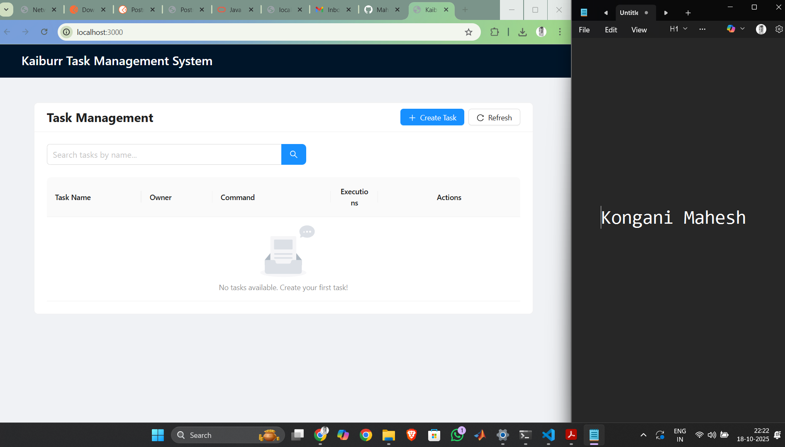
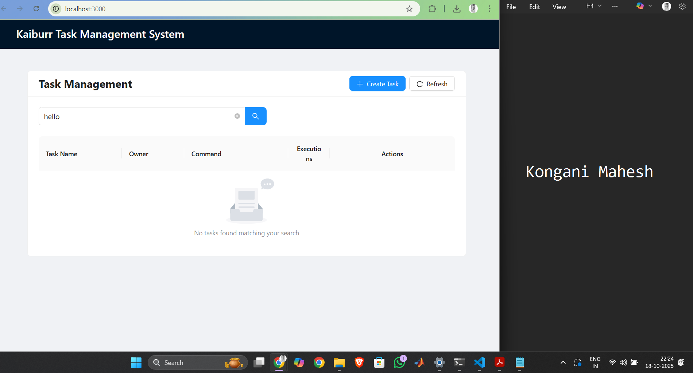
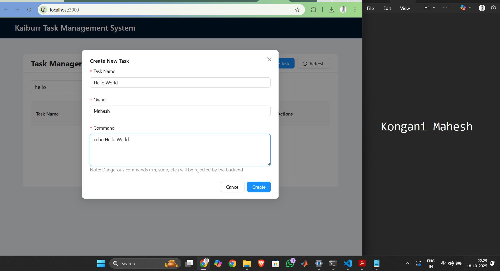
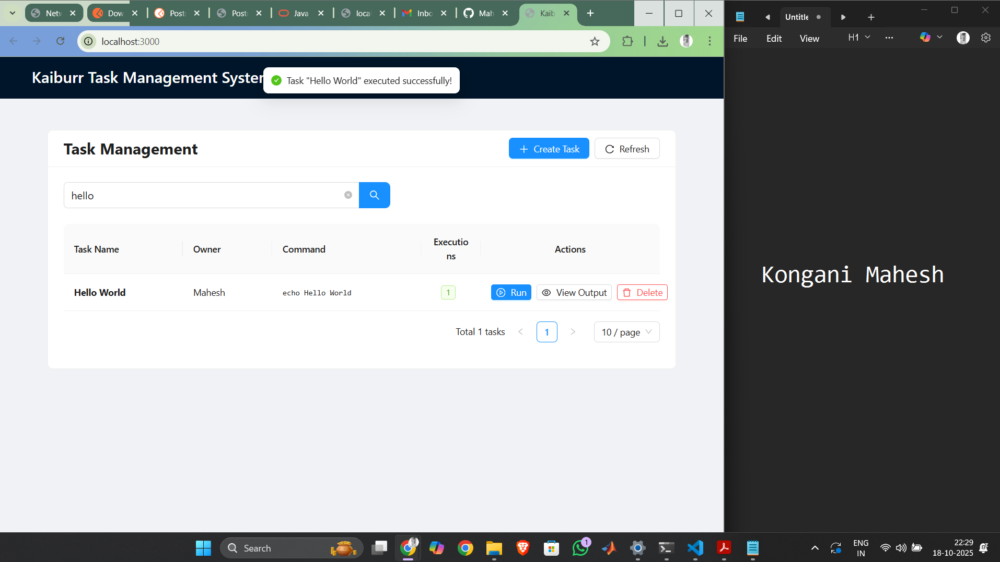
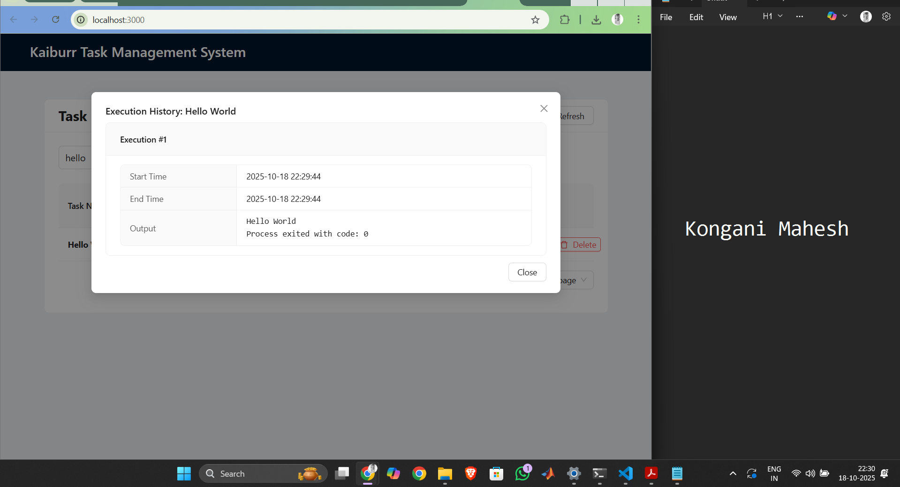
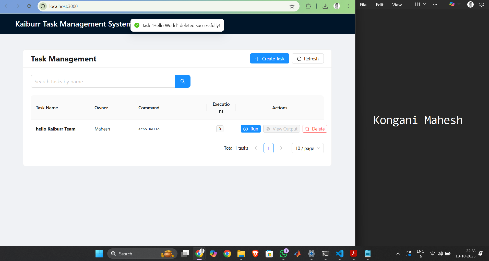

# Kaiburr Assessment - Task 3
## Web UI for Task Management

A React-based frontend application providing a user interface for managing tasks via the Kaiburr REST API.

## Technology Stack

- React 18.2.0 | TypeScript 5.2.2 | Ant Design 5.12.0 | Axios 1.6.0 | Vite 5.0.8

## Features

- View all tasks in sortable, paginated table
- Search tasks by name
- Create new tasks with validation
- Execute tasks and view output
- Delete tasks with confirmation
- Real-time API integration

## Prerequisites

- Node.js 16+
- npm package manager
- Backend API on `http://localhost:8080` (Task 1)

## Installation & Setup

```bash
git clone https://github.com/Mah03esh/kaiburr-task3.git
cd kaiburr-task3
npm install
npm run dev  # Starts on http://localhost:3000
npm run build  # Production build
```

## Project Structure

```
task3/
├── src/
│   ├── components/          # TaskList.tsx, TaskForm.tsx
│   ├── services/api.ts      # API integration
│   └── App.tsx              # Root component
├── Dockerfile
└── screenshots/
```

## Docker Deployment

```bash
docker build -t kaiburr-task3-frontend .
docker run -p 3000:80 kaiburr-task3-frontend
```


## Testing & Validation

All UI interactions tested manually. Test scenarios follow Given-When-Then syntax.

**Scenario 1: Application Startup**  
Given Node.js and dependencies are installed  
When the development server starts via `npm run dev`  
Then the application loads on port 3000 and connects to the backend API  

**Scenario 2: View All Tasks**  
Given tasks exist in the backend database  
When the homepage loads  
Then all tasks are displayed in a table with columns for name, owner, command, and actions  

**Scenario 3: Search Tasks**  
Given tasks with matching names exist  
When a user enters a search term  
Then the table filters to show only matching tasks  

**Scenario 4: Create New Task**  
Given the user clicks "Create Task" button  
When the form is filled with name, owner, and command  
Then a PUT request is sent and the new task appears in the table  

**Scenario 5: Execute Task**  
Given a task exists in the table  
When the user clicks the "Execute" button  
Then the command runs and execution details appear  

**Scenario 6: Delete Task**  
Given a task exists in the table  
When the user clicks "Delete" and confirms  
Then the task is removed from the database and table


## Screenshots

All UI interactions tested and documented with screenshots. Test scenarios follow Given-When-Then syntax.

### Screenshot 1: Main Task List View

**Scenario: View All Tasks in Dashboard**  
Given the React application is running and connected to the backend API  
When the user navigates to the homepage  
Then all existing tasks are displayed in a table with columns for Task Name, Owner, Command, Execution Count, and Actions  
And the search bar and "Create Task" button are visible at the top  



---

### Screenshot 2: Search Functionality

**Scenario: Search Tasks by Name**  
Given multiple tasks exist in the database  
When the user enters a search term in the search input field  
Then the table dynamically filters to show only tasks with matching names  



---

### Screenshot 3: Create Task Form

**Scenario: Create New Task via Modal Form**  
Given the user is on the task list page  
When the user clicks "Create Task" button  
Then a modal dialog appears with a form containing three input fields  
When the user fills in all required fields and clicks "Create"  
Then a PUT request is sent to `/api/tasks` and the new task appears in the table  



---

### Screenshot 4: Task Execution

**Scenario: Execute Task Command**  
Given a task exists in the task list with a valid command  
When the user clicks the "Run" button (play icon) in the Actions column  
Then a PUT request is sent to `/api/tasks/execute/{id}`  
And the command executes on the backend  
And a success notification appears  



---

### Screenshot 5: Execution History View

**Scenario: View Task Execution History**  
Given a task has been executed at least once  
When the user clicks the "View Output" button for that task  
Then a modal dialog opens displaying the execution history  
And each execution shows startTime, endTime, and command output  



---

### Screenshot 6: Delete Task Confirmation

**Scenario: Delete Task with Confirmation**  
Given a task exists in the task list  
When the user clicks the "Delete" button (trash icon) in the Actions column  
Then a confirmation dialog appears  
When the user confirms the deletion  
Then a DELETE request is sent to `/api/tasks/{id}` and the task is removed  



---

## Troubleshooting

**Backend Connection Issues**: Verify backend is running at `http://localhost:8080/api/tasks`

**Port Already in Use**: Kill process using port 3000 or modify `vite.config.ts`

## Author

**Mahesh** - Created for Kaiburr Assessment - Task 3

## License

This project is created for assessment purposes.
